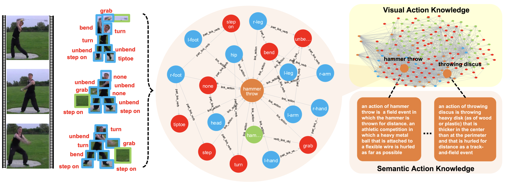
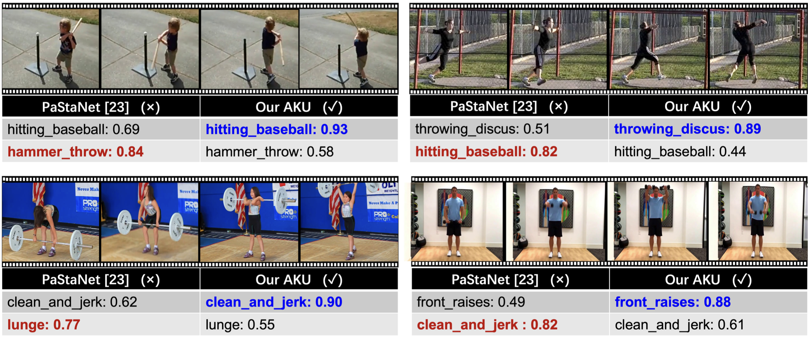

## 🚀 [ACM MM  Oral  2022] **AKU**: Action Knowledge Understanding framework

This is the official repository of our ACM Multimedia 2022 Work.
**Kinetic-TPS dataset** and pytorch training/validation code for **Visual Knowledge Graph for Human Action Reasoning in Videos**.

# 🏚️ Introduction

# 🏝️ Visualizations

# 🏰 Acknowledgement
This work is partially supported by National Natural Science Foun-
dation of China (61876176), the Joint Lab of CAS-HK, the Shanghai
Committee of Science and Technology (Grant No. 21DZ1100100).
